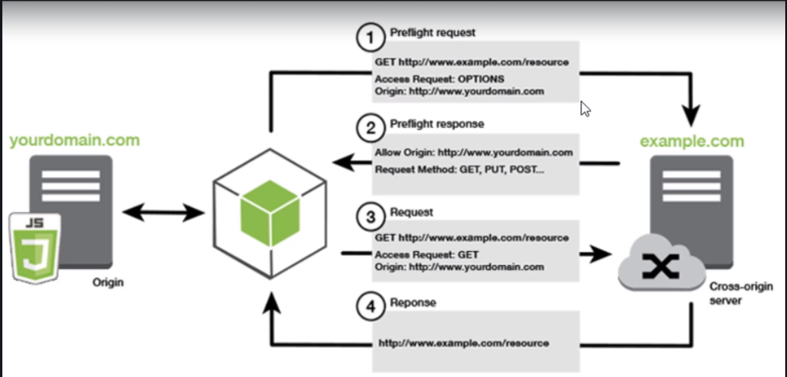

# Spring5ConAngular

## 4. Backend: Spring API REST 01:28:02

**REST** REpresentational State Transfer Transferencia de Estado Representacional.

Es un protocolo entre cliente y servidor sin estado (Stateless), en el BackEnd no se maneja ningún tipo de sesiones eso se manejara en el Front End usando el SessionStorage o LocalStorage de HTML5.

Una de las aplicaciones principales es integrar aplicaciones utilizando REST para **obtener datos** desde el BackeEnd en formato JSON a un cliente o **enviar datos** desde cualquier cliente al BackeEnd y realizar operaciones CRUD en la BD.

La transferencia y envio de datos se realiza a través de un **ENDPOINT** que es una URL o URI que envía una petición HTTP al servidor con diferentes métodos o verbos del Request, por ejemplo:

Verbos | URI                | Action o Handler
-------|--------------------|------------
GET    |/clientes           | index()
GET    |/clientes/create    | create()
POST   |/clientes           | storre()
GET    |/clientes/{id}      | show()
GET    |/clientes/{id}/edit | edit()
PUT    |/clientes/{id}      | update()
DELETE |/clientes/{id}      | destroy()


### Descargar Código Fuente 00:03

:+1:

### Demostración de lo que lograremos al finalizar las siguientes secciones 02:33

* CRUD con paginación
* Insertar, Editar y Eliminar Clientes
* Ver detalles del perfil con un modal
* Subir una imágen
* Uso de Date Picker
* Relaciones de tablas

### Herramientas necesarias Backend 06:46

* JDK (Java SE Development Kit (JDK(Desarrollo) + JRE(Ejecución))
* IDE Eclipse + Spring Tools
* Maven
* MySQL
* Postman

#### Instalar JDK

[Download JDK](https://www.oracle.com/technetwork/java/javase/downloads/index.html)

```
java -version
java version "1.8.0_231"
```

#### Instalar Eclipse

[Eclipse](https://www.eclipse.org/)

[Download Packages](https://www.eclipse.org/downloads/packages/)

Debemos descargar [Eclipse IDE for Enterprise Java Developers](https://www.eclipse.org/downloads/packages/release/2019-12/r/eclipse-ide-enterprise-java-developers)

### Instalación y configuración del IDE Eclipse 06:40

Debemos descomprimir el ZIP descargado y ejecutar el archivo **eclipse.exe**. Nos pide el lugar de nuestro workspace.

#### Instalar Spring Tools 4 (4.5.0 Release)

* Ir `Help / Eclipse Marketplace` y en `Find` escribir `Spring` y `Enter`, en el listado nos saldra **Spring Tools 4 - for Spring Boot (aka Spring Tool Suite 4) 4.5.0 RELEASE** pulsamos en el botón `Install`.
* Con todo seleccionado pulsamos en `Confirm`.
* Aceptamos las licencias, terminos y pulsamos el botón `Finish`.
* Se instala el software y nos pide reiniciar Eclipse.

Con todo esto hecho en la barra de herramientas nos aparecerá el icono de **Boot Dashboard**
* Pulsamos en el icono y nos aparece la pestaña **Boot Dashboard** 

En esta pestaña tendremos nuestro proyecto Spring Boot.

#### Crear proyecto Spring

Para crear un proyecto Spring podemos seguir los siguientes pasos:

* Seleccionar `File / New / Other...`
* Seleccionar `Spring Boot` y se nos presentan dos opciones:
   * `Import Spring Started Content`
   * `Spring Starter Project`
* Seleccionamos `Spring Starter Project` y se nos pediran varios datos
   * Name
   * Type
      * Maven (Usa una estructura XML)
      * Gradle (Usa una estructura DSL (domain-specific language) o lenguaje de dominio específico)
   * Packaging
      * Jar (Proyectos Spring que no utlizan parte visual (JSPs))
      * War (Proyectos Spring con parte visual o que se desplegaran en un servidor externo)
   * Java Version
   * Language
      * Java
      * Kotlin
      * Groovy

#### Eclipse configurado por el equipo de Spring

Existe un Eclipse ya configirado con Spring Boot creado por el equipo de [Spring](https://spring.io/), hasta el final de la página tenemos el [link de tools](https://spring.io/tools) donde se nos permite descargar un Eclipse ya configurado con Spring Boot el cual es muy similar al que instalamos a mano.

### Actualización: Wizard para seleccionar dependencias en Spring Tools 02:25

:+1: 

### Creando Proyecto Backend API REST 10:23

Para crear un proyecto nuevo seguir los siguientes pasos:

* Seleccionar `File / New / Other...`
* Seleccionar `Spring Boot` y se nos presentan dos opciones:
   * `Import Spring Started Content`
   * `Spring Starter Project`
* Seleccionamos `Spring Starter Project` y se nos pediran varios datos
   * Name: **spring-boot-backend-apirest**
   * Type: **Maven**
   * Packaging: **Jar**
   * Java Version: **8**
   * Language: **Java**
   * Group: **com.bolsadeideas.springboot.backend.apirest**
   * Package: **com.bolsadeideas.springboot.backend.apirest**
* Presionamos el botón **Next**, para ir a la ventana de Dependencias o Librerías **New Spring Starter Project Dependencies**
   * Spring Boot Version: **2.2.2** ( La versión más estable hasta el momento**
   * Seleccionar **Web** 
      * Marcar **Spring Web** (Contiene el API, las anotaciones y controladores para crear nuestro REST
   * Seleccionar **SQL**
      * Marcar la dependencia **Spring Data JPA**
      * Marcar la dependencia **MySQL Driver**
   * Seleccionar **Developer Tools**
      * Marcar **Spring Boot DevTools** (Para actualizar automáticamente el deploy cuando se realicen cambios)
* Dar click en **Finish**

Una vez hecho esto se genera la estructura de nuestro proyecto, algunos archivos importantes son:
   
   * **pom.xml**: Contiene la estructura de nuestro proyecto. (Con la información que se metio al crear el proyecto)
   * **application.properties**: Archivo principal de configuración. Permite sobreescribir cualquier configuración del proyecto. (Actualmente vacío)
   * **SpringBootBackendApirestApplication**: Clase principal, es el **Boot Start** el arranque, una clase que se crea de forma automática en el package base de nuestro proyecto. Contiene lo siguiente:
      * **@SpringBootApplication**: anotación más importante de la aplicación 
   
#### Ejecutar nuestro proyecto

* Colocarnos en la raiz del proyecto
* Pulsar click derecho
* Seleccionar `Run As / Spring Boot App`

Nos marcara algún error por que aún falta configurar el proyecto.

### Configurando el Datasource a MySQL en el proyecto backend 06:46

Ir a **application.properties** e insertar el siguiente codigo:
 
 ```
spring.datasource.url=jdbc:mysql://localhost/db_springboot_backend?usesSSL=false&serverTimezone=UTC&useLegacyDatetimeCode=false
spring.datasource.username=root
spring.datasource.password=
spring.datasource.driver-class-name=com.mysql.cj.jdbc.Driver
spring.jpa.database-platform=org.hibernate.dialect.MySQL57Dialect
spring.jpa.hibernate.ddl-auto=create-drop
logging.level.org.hibernate.SQL=debug
 ```

### Instalando MySQL 04:12

Ir a [MySQL](https://www.mysql.com/), vamos a [MySQL Community (GPL) Downloads](https://dev.mysql.com/downloads/) Seleccionamos MySQL Community Server 8.0.18 y descargamos la versión completa para nuestro Sistema Operativo. 
Ejecutarlo para instalar:
* MySQL Server
* Workbeanch

### Creando la Base de Datos 03:11

Vamos a crear la BD `db_springboot_backend` con comandos seria así:

```
> mysql -u root -p
Enter password:
...
MySQL [(none)]> CREATE DATABASE db_springboot_backend;

MySQL [(none)]> show databases;
```

#### Probar la conexión

Una vez creada la BD podemos crear la conexión ejecutando la aplicación. `Run As / Spring Boot Ass`. 
Se levanta el servidor sin errores y en la **consola** podemos ver el dialecto que esta utilizando **Using dialect: org.hibernate.dialect.MySQL57Dialect** es el que configuramos.

#### Abrir la BD en Workbeanch

Podemos abrir la BD creada en Workbeanch, actualmente no tendra tablas pero ya las crearemos.

### Añadiendo la clase Entity Cliente al Backend 08:20

Vamos a crear la clase **Entity Cliente**, la idea es que esta clase este mapeada a la tabla Clientes y represente la persistencia o datos de los clientes por el lado del servidor. Vamos a seguir los siguientes pasos:

* Crear dentro del package principal el package **models.entity**.
* Dentro del nuevo package creamos la clase **Cliente**
* Declaramos las propiedades de la clase:
```java
public class Cliente {
	
	private Long id;
	private String nombre;
	private String apellido;
	private String email;
	private Date createAt;

}
```
* Añadimos los `Getters` y `Setters` de todas las propiedades:
```java
public Long getId() {
		return id;
	}

	public void setId(Long id) {
		this.id = id;
	}

	public String getNombre() {
		return nombre;
	}

	public void setNombre(String nombre) {
		this.nombre = nombre;
	}

	public String getApellido() {
		return apellido;
	}

	public void setApellido(String apellido) {
		this.apellido = apellido;
	}

	public String getEmail() {
		return email;
	}

	public void setEmail(String email) {
		this.email = email;
	}

	public Date getCreateAt() {
		return createAt;
	}

	public void setCreateAt(Date createAt) {
		this.createAt = createAt;
	}

```
* El siguiente paso es convertir esta clase en una clase **Entity**, en una clase de persistencia que esta mapeada a una tabla de una BD, cada atributo de la clase corresponde a un campo en la tabla, los pasos son:
   * Implementar la **interface Serializable**:    `public class Cliente implements Serializable {`
   * Crear el **default serial version ID** pulsando el foco amarillo que sale: `private static final long serialVersionUID = 1L;` es un atributo estatico que es requerido cuando se implementa el serializable.
   * Marcar la clase para indicar que se trata de una clase Entity con: `@Entity` importarla de `javax.persistence`
   * La siguiente anotación no seria necesaria si la Tabla y la Clase se llaman igual pero en este caso no sera así (por que la tabla se llama **clientes**: `@Table(name="clientes")`
   * La siguiente anotación nos va a permitir indicar que nuestra propiedad id corresponde a la clave primaria: `@Id`
   * También debemos indicar como se genera o cual es la estrategia de generación de esta llave en la BD: `@GeneratedValue(strategy=GenerationType.IDENTITY)` para MySQL es IDENTITY, para Oracle es SeQUENCE.
   * Para las propiedades **nombre**, **apellido** e **email** van a representar columnas por lo que se podrían anotar con `@Column` sin embargo, cuando el nombre del campo y la propidad son iguales se puede omitir. Se utilizaría si los nombres no son iguales, o para indicar la longitud, para indicar si acepta nulos, etc. Para estas propiedades no lo usaremos.
   * Para la propiedad **createAt** si usaremos la anotación `@Column()` como sigue: `@Column(name="create_at")`
   * También le aplicaremos la antoación `@Temporal()` para indicar cual va a ser la transformación o tipo equivalente en la BD: `@Temporal(TemporalType.DATE)` transforma la fecha de Java a la de SQL. 
   
Eso es todo, ya tenemos nuestra clase Entity, que esta mapeada parte del contexto de persistencia de JPA, por lo tanto esta sincronizada con la BD:

```java
package com.bolsadeideas.springboot.backend.apirest.models.entity;

import java.io.Serializable;
import java.util.Date;

import javax.persistence.Column;
import javax.persistence.Entity;
import javax.persistence.GeneratedValue;
import javax.persistence.GenerationType;
import javax.persistence.Id;
import javax.persistence.Table;
import javax.persistence.Temporal;
import javax.persistence.TemporalType;

@Entity
@Table(name="clientes")
public class Cliente implements Serializable {

	
	@Id
	@GeneratedValue(strategy=GenerationType.IDENTITY)
	private Long id;
	
	private String nombre;
	private String apellido;
	private String email;
	
	@Column(name="create_at")
	@Temporal(TemporalType.DATE)
	private Date createAt;

	public Long getId() {
		return id;
	}

	public void setId(Long id) {
		this.id = id;
	}

	public String getNombre() {
		return nombre;
	}

	public void setNombre(String nombre) {
		this.nombre = nombre;
	}

	public String getApellido() {
		return apellido;
	}

	public void setApellido(String apellido) {
		this.apellido = apellido;
	}

	public String getEmail() {
		return email;
	}

	public void setEmail(String email) {
		this.email = email;
	}

	public Date getCreateAt() {
		return createAt;
	}

	public void setCreateAt(Date createAt) {
		this.createAt = createAt;
	}
	
	private static final long serialVersionUID = 1L;

}
```

Vamos a ejecutar el proyecto para ver como se genera la tabla.
Si vemos el log nos indica:

```
2020-01-02 18:52:40.014 DEBUG 21596 --- [  restartedMain] org.hibernate.SQL                        : drop table if exists clientes
2020-01-02 18:52:40.028 DEBUG 21596 --- [  restartedMain] org.hibernate.SQL                        : create table clientes (id bigint not null auto_increment, apellido varchar(255), create_at date, email varchar(255), nombre varchar(255), primary key (id)) engine=InnoDB
```
Esta boorando la tabla si existe y luego la crea con todas las caracteristicas en los campos que se definieron en la clase.

Podemos abrir el Workbeanch y ver nuestra tabla desde allí. Cabe aclarar que el orden de los campos es alfabetico a excepción del id por ser clave primaria.

`id   apellido   create_at   email   nombre`

### Añadiendo las clases Repository y Service de la lógica de negocio 11:48

Vamos a comenzar creando la clase de acceso a datos DAO o Repository la cual tiene como función acceder a los datos para realizar consultas y todo tipo de operaciones en la BD. 

Después crearemos la clase Service que en el fondo puede contener a las clases DAO que interactuan todas bajo una misma transacción, el objetivo principal del Service es evitar ensuciar el Controlador con las clases DAO, simplemente se desacopla y se lleva a una fachada.

Hay diferentes formas de implementar un DAO, podemos crear una clase, podemos trabajar directamente con el Entity manager con JPA implementar todo de forma manual pero Spring tiene un componente bastante potente, robusto que se llama **Spring Data JPA** y esto nos ahorra un montón de trabajo de tener que estar implementando todos métodos y consultas de JPA de forma manual.

Simplemente se implementa una interfaz, heredamos de la interfaz CRUD repositor y prácticamente estamos listos ya trae todos los métodos básicos para un CRUD, para poder listar, para buscar, para modificar, para guardar y para eliminar.

Y además si queremos podemos implementar nuestros propios métodos customizados usando la notación @Query o también utilizando el nombre el método cosa que vamos a ver un poco en esta clase.

#### Crear la Clase Repository o DAO

Pero vamos a implementar primero la interfaz DAO:

* Crear el package **models.dao** dentro del package principal.
* Clic derecho en el package models.dao y damos `New / Interface`
* Name: **IClienteDao**

Crea el archivo:

```java
package com.bolsadeideas.springboot.backend.apirest.models.dao;

public interface IClienteDao {

}
```
* Vamos a extender de **CrudRepository**:
```java
public interface IClienteDao extends CrudRepository<T, ID>{

}
```
* Propone un tipo generico en `T` debemos poner la clase Entity que esta asociada a este DAO o Repository, en este caso la clase **Cliente** que creamos previamente y en `ID` tenemos que poner el tipo de dato de la llave `id`:
```java
public interface IClienteDao extends CrudRepository<Cliente, Long>{
```

Si damos un `Ctrl + Click` sobre `CruRepository` nos vanos a los métodos de esta interfaz `Interface for generic CRUD operations on a repository for a specific type.`.

Tenemos el método **save**  que recibe un genérico de una entidad.
Tenemos el método **saveAll** para guardar varias entidades.
Tenemos el método **findById** para buscar por ID, retorna un Optional. Un Optional es una clase, un tipo de dato que nos permite manejar mejor el resultado. Por ejemplo si se realizó bien la consulta va a retornar el objeto con get. Si no podemos manejar el error con manejo de excepción o bien retornar Null.
Tenemos el método **existsById** para comprobar si existe.
Tenemos el método **findAll** para buscar todas. Retorna un Iterable.
Tenemos el método **deleteById** para eliminar por ID.
Tenemos el método **delete** para borrar por un objeto Entity.

Y varios métodos y propiedades más.

**Ya podemos contar con los métodos que estamos heredando, ya los podemos usar practicamente sin hacer nada, solo por haber utilizado `CrudRepository`.**

#### Spring Data JPA

 Podriamos revisar la documentación de [Spring Data JPA](https://spring.io/projects/spring-data-jpa) y ver su [Documentación](https://docs.spring.io/spring-data/jpa/docs/2.2.3.RELEASE/reference/html/#reference) para ver más detalles.

Tenemos `4.1. Core concepts` concepto del core una interfaz Repository tal como la vimos y esta interesante porque va a realizar las consultas y operaciones de acuerdo al nombre el método.

Si tenemos el nombre **save** va a realizar un **persist en JPA**. Por lo tanto hace un **insert a la BD**, si hacemos un **findById** va a realizar una consulta **select a la clase entity**, en nuestro caso cliente **where al atributo id** que sea igual al parámetro entonces de acuerdo al nombre del método va a realizar la consulta incluso en `4.2. Query methods` en la documentación tenemos [más detalles](https://docs.spring.io/spring-data/jpa/docs/2.2.3.RELEASE/reference/html/#repositories.query-methods.details) para hacer nuestra consulta.

```java
interface PersonRepository extends Repository<Person, Long> {

  List<Person> findByEmailAddressAndLastname(EmailAddress emailAddress, String lastname);

  // Enables the distinct flag for the query
  List<Person> findDistinctPeopleByLastnameOrFirstname(String lastname, String firstname);
  List<Person> findPeopleDistinctByLastnameOrFirstname(String lastname, String firstname);

  // Enabling ignoring case for an individual property
  List<Person> findByLastnameIgnoreCase(String lastname);
  // Enabling ignoring case for all suitable properties
  List<Person> findByLastnameAndFirstnameAllIgnoreCase(String lastname, String firstname);

  // Enabling static ORDER BY for a query
  List<Person> findByLastnameOrderByFirstnameAsc(String lastname);
  List<Person> findByLastnameOrderByFirstnameDesc(String lastname);
}
```
Podemos realizar consulta en la interfaz, implementar métodos personalizados por ejemplo en `List<Person> findByEmailAddressAndLastname(EmailAddress emailAddress, String lastname);`:

* **find** para hacer un **select**
* **By** para el **where**
* **And** para poner condiciones **where ...and..**
* **EmailAddress** igual al primer parámetro **emailAddress**
* **Lastname** igual al segundo parámetro **lastname**

En `List<Person> findPeopleDistinctByLastnameOrFirstname(String lastname, String firstname);` tenemos para el **distinct**, tenemos otros operadores por ejemplo:

`Between, LessThan, GreaterThan, Like`

Otra alternativa aparte de realizar consulta a través del nombre del método es utilizar una [anotación @Query](5.3.4. Using @Query). Podemos tener un método con algún nombre que le queremos dar y lo anotamos con `@Query` y entre los parentesis colocamos la consulta de JPA o Hibernate. Recordemos que estas consultas son **HQL** es decir de **Hibernate Query Language** orientada a objetos, no a tablas.  También pueden recibir parámetros, veamos el ejemplo:

```java
public interface UserRepository extends JpaRepository<User, Long> {

  @Query("select u from User u where u.emailAddress = ?1")
  User findByEmailAddress(String emailAddress);
}
```

#### Crear la Interfaz Service

El siguiente paso es crear la clase Service:

* Vamos a crear un nuevo package **models.services*
* Dentro del nuevo package creamos una Interface **IClienteService**
```java
package com.bolsadeideas.springboot.backend.apirest.models.services;

public interface IClienteService {

}
```
* A esta interfaz le daremos un contrato de implementación, los métodos del CRUD. Empezamos con el **findAll**:
```java
package com.bolsadeideas.springboot.backend.apirest.models.services;

import java.util.List;
import com.bolsadeideas.springboot.backend.apirest.models.entity.Cliente;

public interface IClienteService {

	public List<Cliente> findAll();
}
```
#### Crear la Clase Service

Vamos a crear la clase **ClienteServiceImpl** para implementar el método findAll() definido anteriormente en la interfaz:
```java
package com.bolsadeideas.springboot.backend.apirest.models.services;

public class ClienteServiceImpl {

}
```
Lo primero que hacemos es implementar **IClienteService** con lo que automáticamente nos pedirá implementar el método findAll(), nuestra clase queda así:
```java
package com.bolsadeideas.springboot.backend.apirest.models.services;

import java.util.List;

import org.springframework.beans.factory.annotation.Autowired;
import org.springframework.stereotype.Service;
import org.springframework.transaction.annotation.Transactional;

import com.bolsadeideas.springboot.backend.apirest.models.dao.IClienteDao;
import com.bolsadeideas.springboot.backend.apirest.models.entity.Cliente;

//Anotar como Service para marcarla como una clase de Servicio
@Service
public class ClienteServiceImpl implements IClienteService{

	//Inyectar (Inyección de dependdencias) el ClienteDao
	@Autowired
	private IClienteDao clienteDao;
	
	@Override
	@Transactional(readOnly = true) //Permite manejar transacción en el método y como es un Select será sólo de lectura
	public List<Cliente> findAll() {
		//Como findAll() retorna un Iterable le hacemos un CAST
		return (List<Cliente>) clienteDao.findAll();
	}

}
```

Tuvimos que inyectar **IClienteDao** usando **@Autowired** (Inyección de dependencias). Entonces en el método **findAll()** debe retornar una lista de todos los clientes, eso ya esta implementado en nuestro **clienteDao** gracias a que a su vez hereda de **CrudRepository**, por lo que tiene que retorarse **clienteDao.findAll()** pero como esto retorna un Iterable debemos hacer un cast por lo que finalmente nos queda: 
`return (List<Cliente>) clienteDao.findAll();`

Luego tuvimos que anotar con **@Transactional(readOnly = true)** esta anotación nos permite manejar transacción en el método, y como es una consulta, un  Select sería solamente de lectura.

De todas formas los métodos del **CrudRepository** ya vienen con transaccionalidad ya son transaccionales. Por lo tanto podríamos omitir esta notación.

Ahora yo prefiero anotarla en el Service ya que describe la transaccionalidad de la clase **Repository** más que nada para tener el control y hacerlo de una forma más explícita. Pero de todas formas se puede omitir así que daría exactamente igual

Pero todos los métodos nuevos que queramos implementar en el **IClienteDao** ya sea a través del nombre del método o utilizando la
anotación **@Query** ahí si tendríamos que utilizar el **@Transactions**, solamente para los métodos propios.

También quería destacar que **@Autowired** una anotación para inyectar el **IClienteDao**, a pesar de que es una interfaz pero por detrás de escena Spring va a crear una instancia de una implementación concreta utilizando la interfaz y va a quedar guardada en el contenedor de Sprint en el contexto.

Por lo tanto la podemos inyectar en cualquier otro componente, ya sea una clase **Service**, ya sea en un Controlador en cualquier clase de nuestra aplicación.

Para finalizar anotamos con **@Service** la clase, una anotación muy importante ya que con esto decoramos y marcamos esta clase como un componente de servicio en Sprint y también se va a guardar en el contenedor de Sprint va a quedar almacenado en el contexto. Y después podemos inyectar este objeto, este Beans de Sprint en el controlador y lo podemos utilizar pero para eso tenemos que decorarlo y Service lo que hace es justamente eso, si vemos su definición veremos que es un estereotipo de **@Component**. Por lo tanto con **@Component** marca la clase, la decora para que sea un componente del Framework un Beans y se registra en el contenedor.

### Creando controlador @RestController y EndPoint para listar 04:22

Vamos a crear nuestro API Rest un controlador Rest que es una URL que vamos a utilizar para conectar y enviar datos, peticiones a nuestra aplicación por ejemplo para listar nuestro cliente en nuestra aplicación con angular.


* Crear package **controllers**
* Crear la clase **ClienteRestController**
```java
package com.bolsadeideas.springboot.backend.apirest.controllers;

public class ClienteRestController {

}
```

* Lo primero que tenemos que implementar es decorador a nuestra clase con la anotación **@RestController** a diferencia de un controlador normal web MVC con vistas que se anotaría con **@Controller** en este caso como es un API REST, se anota con **@RestController**.

* El siguiente paso es en mapear nuestro **RestController** con **@RequestMapping** para generar nuestra URL, el endpoint, entonces nos queda `@RequestMapping("/api")` 

* Luego vamos a crear el método **index()** que va a retornar un listado de clientes. Necesitamos ir al modelo a la clase Service y obtener el listado de clientes. Para eso tenemos que inyectar con **Autowired** recordemos que en la sección anterior creamos la clase **ClienteServiceImpl** que está decorada con **@Service**, por lo tanto ya es un componente, si revisábamos la anotación vemos que es un **@Component** un componente, por lo tanto ya está dentro del contexto y registrado en el contenedor simplemente la podemos inyectar:

```java
@Autowired
private IClienteService clienteService;
```
Recordemos que en Spring cuando se declara un Beans con su tipo genérico ya sea una interfaz o clase abstracta va a buscar el primer candidato, una clase concreta que implemente esta interfaz y la tenemos en **ClienteServiceImpl** en la implementación concreta, pero implementa la interfaz **IClienteService**. Por lo tanto este Beans es un tipo de la interfaz, por lo tanto se puede definir como un tipo genérico de la interfaz y busca una implementación concreta y la inyecta, si tuviera más de una habría que usar un calificador. 

* Ya podemos hacer retornar los datos:
```java
public List<Cliente> index(){
	return clienteService.findAll();
}
``` 

* Lo último que faltaría sería mapear la URL para generar nuestro EndPoint del método, podemos usar **@GetMapping** ya que es una petición get poniendo la URL con la que queremos hacer el mapeo:

```java
@GetMapping("/clientes")
public List<Cliente> index(){
	return clienteService.findAll();
}
```

El código completo de la clase **ClienteRestController** es:

```java
package com.bolsadeideas.springboot.backend.apirest.controllers;

import java.util.List;

import org.springframework.beans.factory.annotation.Autowired;
import org.springframework.web.bind.annotation.GetMapping;
import org.springframework.web.bind.annotation.RequestMapping;
import org.springframework.web.bind.annotation.RestController;

import com.bolsadeideas.springboot.backend.apirest.models.entity.Cliente;
import com.bolsadeideas.springboot.backend.apirest.models.services.IClienteService;

@RestController
@RequestMapping("/api")
public class ClienteRestController {
	
	@Autowired
	private IClienteService clienteService;
	
	
	@GetMapping("/clientes")
	public List<Cliente> index(){
		return clienteService.findAll();
	}
}
```
Este sería nuestro API REST nuestro controlador utilizando RestController mapeamos con `/api` todos los métodos del REST y luego cada método va a tener su propio EndPoint:

Verbos | URI                | Action o Handler
-------|--------------------|------------
GET    |/clientes           | index()
GET    |/clientes/create    | create()
POST   |/clientes           | storre()
GET    |/clientes/{id}      | show()
GET    |/clientes/{id}/edit | edit()
PUT    |/clientes/{id}      | update()
DELETE |/clientes/{id}      | destroy()

### Añadiendo Datos de pueba 02:54

En esta sección vamos a agregar los datos de pruebas, ya tenemos configura la base datos, nuestra tabla, la clase del modelo y también el API REST, el controlador anotado con RestController pero para probar nos faltan algunos datos de prueba y es lo que vamos a hacer ahora

* En la carpeta **src/main/resources** vamos a crear un archivo nuevo `New / Other / SQL Development / SQL File` y de nombre le vamos a poner **import.sql**. Este nombre es importante se tiene que llamar de esa forma ya que Spring Boot a través de JPA con Hibernate va a buscar si existe este **import.sql** y va a ejecutar las sentencias que contenga.

* Insertar el siguiente contenido en el archivo **import.sql**

```sql
/* Populate tabla clientes */
INSERT INTO clientes (nombre, apellido, email, create_at) VALUES('Andrés', 'Guzmán', 'profesor@bolsadeideas.com', '2018-01-01');
INSERT INTO clientes (nombre, apellido, email, create_at) VALUES('Mr. John', 'Doe', 'john.doe@gmail.com', '2018-01-02');
INSERT INTO clientes (nombre, apellido, email, create_at) VALUES('Linus', 'Torvalds', 'linus.torvalds@gmail.com', '2018-01-03');
INSERT INTO clientes (nombre, apellido, email, create_at) VALUES('Rasmus', 'Lerdorf', 'rasmus.lerdorf@gmail.com', '2018-01-04');
INSERT INTO clientes (nombre, apellido, email, create_at) VALUES('Erich', 'Gamma', 'erich.gamma@gmail.com', '2018-02-01');
INSERT INTO clientes (nombre, apellido, email, create_at) VALUES('Richard', 'Helm', 'richard.helm@gmail.com', '2018-02-10');
INSERT INTO clientes (nombre, apellido, email, create_at) VALUES('Ralph', 'Johnson', 'ralph.johnson@gmail.com', '2018-02-18');
INSERT INTO clientes (nombre, apellido, email, create_at) VALUES('John', 'Vlissides', 'john.vlissides@gmail.com', '2018-02-28');
INSERT INTO clientes (nombre, apellido, email, create_at) VALUES('Dr. James', 'Gosling', 'james.gosling@gmail.com', '2018-03-03');
INSERT INTO clientes (nombre, apellido, email, create_at) VALUES('Magma', 'Lee', 'magma.lee@gmail.com', '2018-03-04');
INSERT INTO clientes (nombre, apellido, email, create_at) VALUES('Tornado', 'Roe', 'tornado.roe@gmail.com', '2018-03-05');
INSERT INTO clientes (nombre, apellido, email, create_at) VALUES('Jade', 'Doe', 'jane.doe@gmail.com', '2018-03-06');
```

Inserta datos de nombre, apellido, email, create_at, si revisamos la clase Entity tenemos esos mismos datos son atributos de la clase pero que también están mapeados a las columnas en la tabla, en la tabla de clientes y el id es incremental se va a generar de forma automática un Identity que se incrementa en 1 auto incremental.

Vamos a guardar y vamos a ejecutar. En la consola vemos que se insertaron los clientes. Además también tenemos mapeada nuestro API `/api/clientes`. Así que vamos a probar nuestra aplicación, nos vamos al navegador y ejecutamos `http://localhost:8080/api/clientes` muestra la respuesta en formato JSON. Todo perfecto.

### Usando Postman para probar nuestras APIs 04:09

Qué tal cuando trabajamos con API Rest es una buena idea usar Postman que es una herramienta que nos permite probar nuestras API tiene un montón de características que nos ayuda a comprobar por ejemplo si nuestro servicio es rápido si está funcionando correctamente.

En fin ahí tenemos varias herramientas que son bien interesante para poder probar testear y optimizar nuestras API REST Full.

En página de [Postman](https://www.getpostman.com/) podemos descargar la aplicación. 

Una vez que lo tengan instalado nos vamos a Eclipse y levantamos el proyecto, una vez que haya iniciado entonces ejecutamos Postman.


En Postman podemos seleccionar los distintos tipos de petición o los verbos por ejemplo **GET** para consultar un listado o un registro en estructura JSon o incluso XML o cualquier, **POST** para crear un nuevo registro. **PUT** modificar, **DELETE** para eliminar, etc.

Para probar nuestro EndPoitn seleccionamos **GET** e introducimos la URL `http://localhost:8080/api/clientes`

Tenemos **localhost** el puerto 8080, `/api` que sería el **RequestMapping** de primer nivel del controlador y `/clientes` que es el **RequestMapping** de segundo nivel de cada acción, en este caso es un **GetMapping**.

Para ejecutar en Postman presionamos el botón **Send** lo que hace que retorne la respuesta en formato JSON.
```JS
[
    {
        "id": 1,
        "nombre": "Andrés",
        "apellido": "Guzmán",
        "email": "profesor@bolsadeideas.com",
        "createAt": "2018-01-01"
    },
    {
        "id": 2,
        "nombre": "Mr. John",
        "apellido": "Doe",
        "email": "john.doe@gmail.com",
        "createAt": "2018-01-02"
    },
    {
        "id": 3,
        "nombre": "Linus",
        "apellido": "Torvalds",
        "email": "linus.torvalds@gmail.com",
        "createAt": "2018-01-03"
    },
    {
        "id": 4,
        "nombre": "Rasmus",
        "apellido": "Lerdorf",
        "email": "rasmus.lerdorf@gmail.com",
        "createAt": "2018-01-04"
    },
    {
        "id": 5,
        "nombre": "Erich",
        "apellido": "Gamma",
        "email": "erich.gamma@gmail.com",
        "createAt": "2018-02-01"
    },
    {
        "id": 6,
        "nombre": "Richard",
        "apellido": "Helm",
        "email": "richard.helm@gmail.com",
        "createAt": "2018-02-10"
    },
    {
        "id": 7,
        "nombre": "Ralph",
        "apellido": "Johnson",
        "email": "ralph.johnson@gmail.com",
        "createAt": "2018-02-18"
    },
    {
        "id": 8,
        "nombre": "John",
        "apellido": "Vlissides",
        "email": "john.vlissides@gmail.com",
        "createAt": "2018-02-28"
    },
    {
        "id": 9,
        "nombre": "Dr. James",
        "apellido": "Gosling",
        "email": "james.gosling@gmail.com",
        "createAt": "2018-03-03"
    },
    {
        "id": 10,
        "nombre": "Magma",
        "apellido": "Lee",
        "email": "magma.lee@gmail.com",
        "createAt": "2018-03-04"
    },
    {
        "id": 11,
        "nombre": "Tornado",
        "apellido": "Roe",
        "email": "tornado.roe@gmail.com",
        "createAt": "2018-03-05"
    },
    {
        "id": 12,
        "nombre": "Jade",
        "apellido": "Doe",
        "email": "jane.doe@gmail.com",
        "createAt": "2018-03-06"
    }
]
```
Aparte del JSON nos regresa:
`Status: 200OK     Time: 26ms     Size: 1.38 KB`
El Status indica que se realizó correctamente sin ningún problema. También tenemos el tiempo que se demoró el Request y el tamaño de la respuesta. 

#### Pestaña Headers

Además si nos vamos a Headers tenemos el **Content type**  **aplication/json** 

#### Diferentes Vistas

* **Pretty**: Presenta el JSON formateado.
* **Raw**: Presenta el JSON sin formato.
* **Preview**: Muestra un registro por renglón

Para eso lo primero que vamos a tener que hacer es añadir el Cors significa o se le conoce como Cross Origin Resort Charing que permite en el fondo compartir dos aplicaciones compartir o integrar dos aplicaciones que están en diferentes dominios será lo que veremos en la próxima sección.

### Uso de Cors para compartir recursos en API REST 04:02

[CORS](https://developer.mozilla.org/es/docs/Web/HTTP/Access_control_CORS) Significa **Intercambio de Recursos de Origen Cruzado** permite a los navegadores modernos enviar y recibir datos restringidos, como por ejemplo pueden ser flujo de datos, streams, archivo de un dominio, imágenes, hojas de estilo CSS, Script. En general cualquier tipo de recursos, desde un dominio a otro diferente que ha hecho la petición es decir **es un mecanismo de control de acceso HTTP para acceder a ciertos recursos en un servidor Backend**.

Por lo tanto tenemos un cliente que accede a través de un navegador a recursos que están desplegados y servidos en otro dominio. La idea es que el navegador se encargue de toda esta materia de seguridad que ya es un estándar para compartir estos recursos entre diferentes dominios.

El primer paso, se debe configurar Cors en el servidor API REST es decir en el package. Cors determina si se permite compartir recursos en una solicitud de origen cruzado, en un recurso específico en función de si el dominio específico que realiza la solicitud está permitido. El tipo de solicitud HTTP que se realiza si está permitido el GET el POST el PUT el DELETE etc.

**Entonces para resumir el modo en que trabaja Cors es interactuando entre el navegador web y el servidor para determinar si es seguro o no permitir estas peticiones de origen cruzado.**



Primero se envía un Pre Request indicando si el dominio que intenta acceder a este recurso en el servidor tiene acceso a qué tipos de peticiones(1).

Por ejemplo si tiene acceso a POST a GET a PUT a DELETE y va a devolver al navegador todos los métodos que están soportados para este dominio(2).

Luego se envía el Request final que requiere el recurso y ve si este dominio tiene permiso para poder acceder a este recurso y si es así va a devolver la respuesta con el recurso solicitado por ejemplo con el servicio REST en formato JSON o bien si un archivo, una hoja de estilo o JavaScript, una imagen, un video, cualquier flujo de dato del tipo Stream.

Vamos a implementar Cors en nuestra API REST Controller de una forma bastante simple, vámonos a Eclipse. 

* Lo primero es ir a **ClienteRestController** y debemos anotar la clase con la anotación **@CrossOrigin** y entre parentesis ponemos los origenes que tienen acceso a este recurso, en este caso será nuestro dominio de Angular, pero se puede colocar un arreglo de origenes:

`@CrossOrigin(origins = {"http://localhost:4200"})`


Se indica el dominio o la IP del servidor y puede soportar un arreglo. Acá pueden indicar como restricción que puede soportar una lista de dominios permitidos.

Además también podemos especificar los métodos permitidos en un arreglo. Por defecto vamos a dejar todos así que no lo vamos a incluir nada.

También podríamos incluir la cabecera permitida, restricciones sobre los Headers. 

Ahora si que la aplicación Angula se va a poder conectar sin ningún problema y va poder realizar peticiones, le vamos a poder entregar el listado cliente.

### Implementando Servicio Angular con HttpClient 09:28
